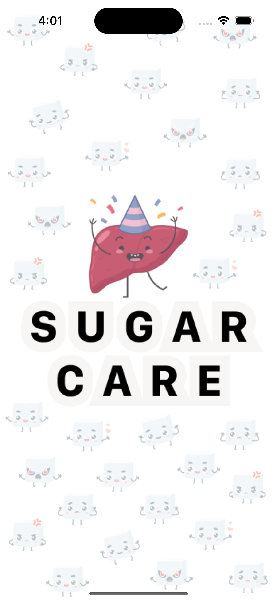
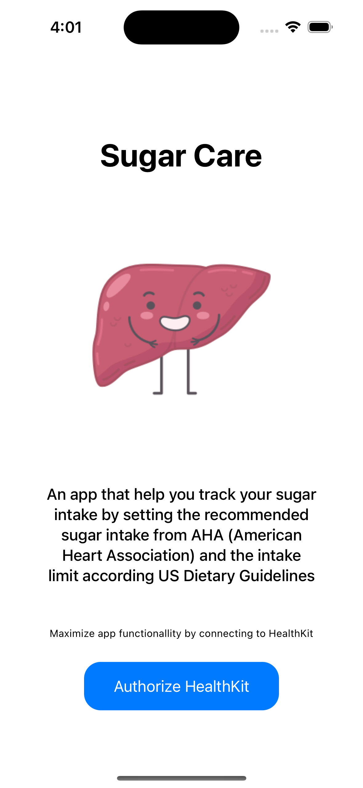
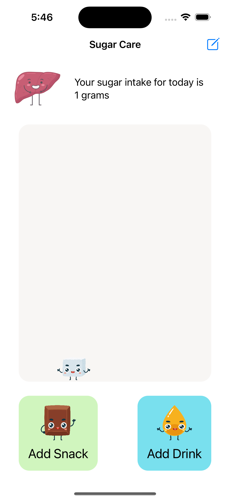
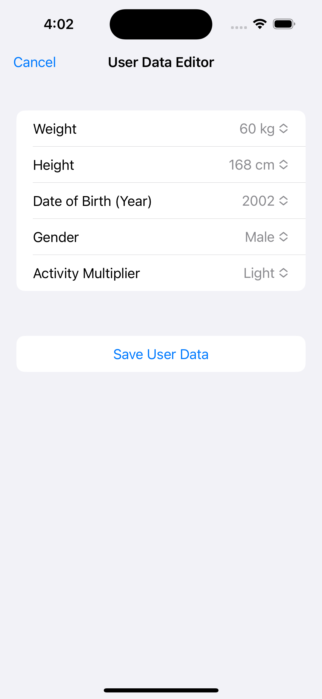
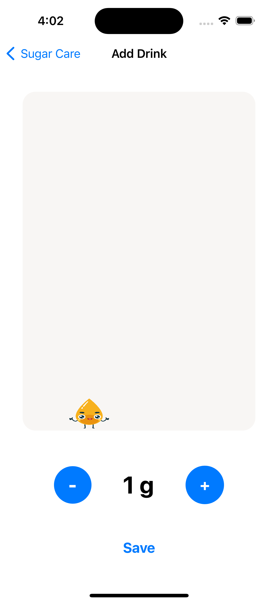
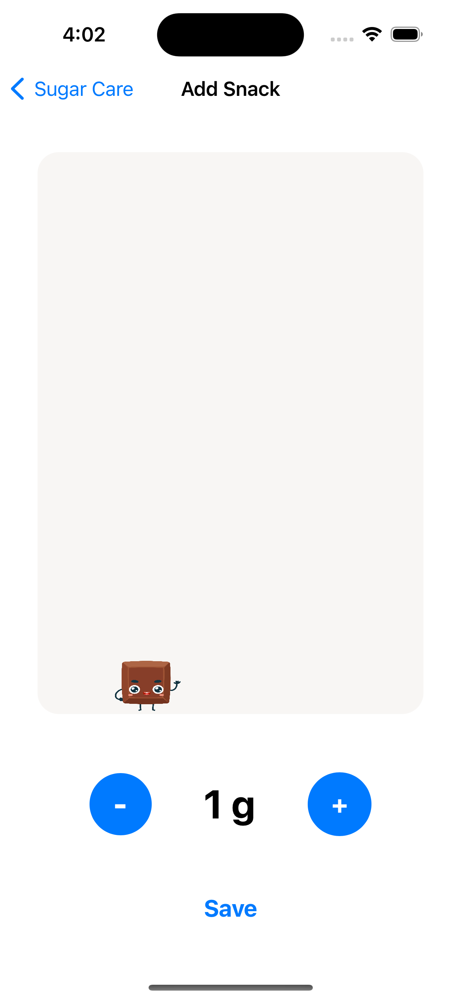

# SugarCare
An app that get and set dietary sugar data using HealtKit Framework
|   |   |   |
|:-:|:-:|:-:|
||||
||||

## Attribution
The images used in the app is dowloaded from [freepik](https://www.freepik.com/) and [flaticon](https://www.flaticon.com/) from various illustrator.

By [macrovector](https://www.freepik.com/author/macrovector):
* [Liver Asset](https://www.freepik.com/free-vector/human-organs-characters-set-with-isolated-icons-liver-having-sickness-mad-alcohol-bottle-burger-vector-illustration_31977420.htm#query=liver%20chibi&position=1&from_view=search&track=location_fest_v1)

By [DrawingMyDiary](https://www.freepik.com/author/drawingmydiary):
* [Golden Liquid](https://www.freepik.com/free-vector/mascot-images-yellow-liquid-set_15757691.htm#&position=10&from_view=author)
* [Choco](https://www.freepik.com/free-vector/cartoon-images-chocolate-set_14877941.htm#page=2&position=17&from_view=author)
* [Sugar](https://www.freepik.com/free-vector/emoticon-set-sugar-cube-first-set-vector-illustration_16302246.htm#query=sugar%20chibi&position=12&from_view=search&track=ais)

By [Freepik](https://www.flaticon.com/authors/freepik):
* [Stop](https://www.flaticon.com/free-icon/stop_3711891?term=x+warning&page=1&position=17&origin=search&related_id=3711891)
* [Warning](https://www.flaticon.com/free-icon/warning_10354763?related_id=10354763)
